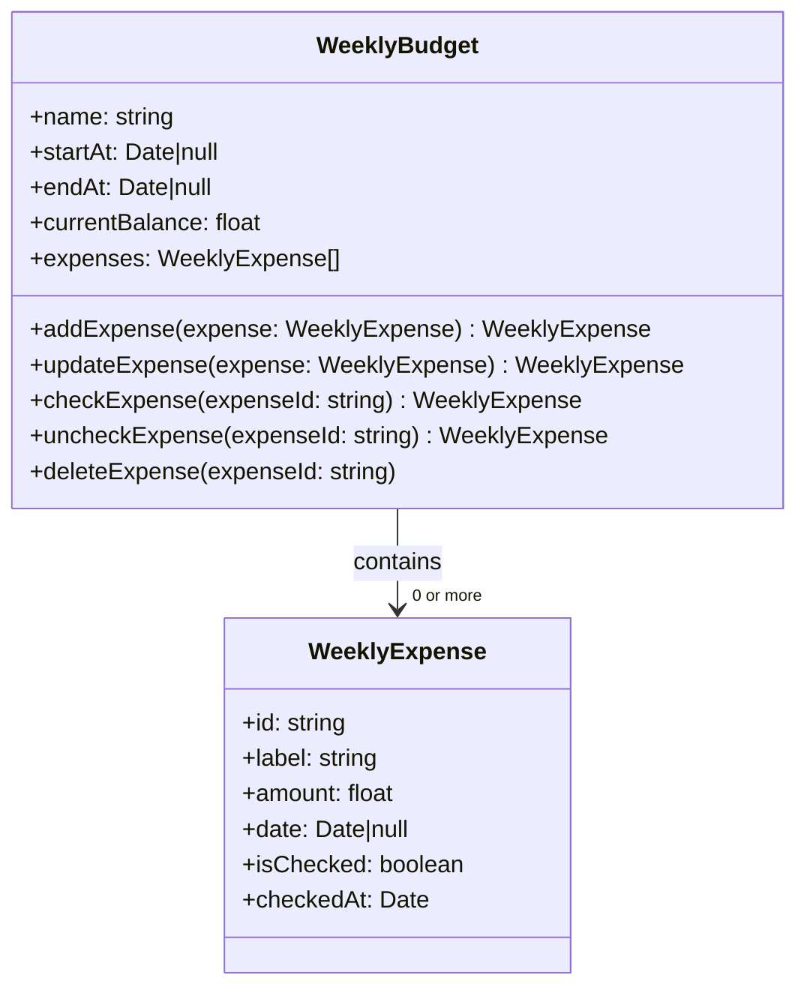

# Ajouter une dépense hebdomadaire

Créer la route permettant d'ajouter une dépense hebdo

## Choses à faire

- ajout du weekBudget->initialBalance
  - create new month : ajouter le à la création dans la DB et donc dans le model de création
- DAO
- migration
- Month->calculate weekly outflows
  - -> currentBalanceForOutflows
- Dashboard->calculate current + forecast
  - current -> currentBalance
  - forecast -> (sum initialBalances) - (sum currentBalances)

## Calculs pour les expenses

F2 initialBalance
F3 checkedExpenses = sum expenses.isChecked === true
F4 uncheckedExpenses = sum expenses.isChecked === false
F7 spentAmounts = sum expenses

F5 currentBalance = initialBalance - spentAmounts
F6 currentBalanceForOutflows = (currentBalance > 0)
    ?  initialBalance - checkedExpenses
    : initialBalance - checkedExpenses - currentBalance

Weekly outflows = currentBalanceForOutflows
Weekly currentBalance = currentBalance

## Draft de classes

