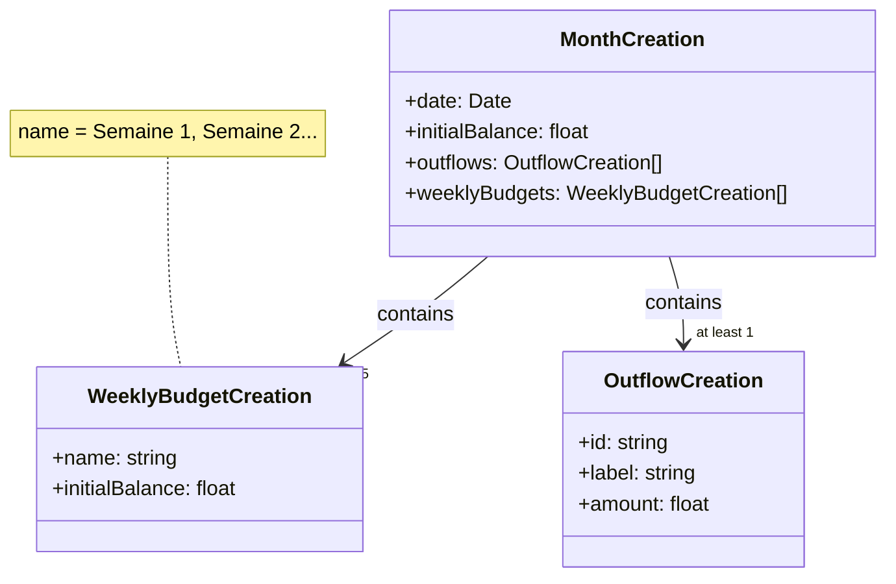
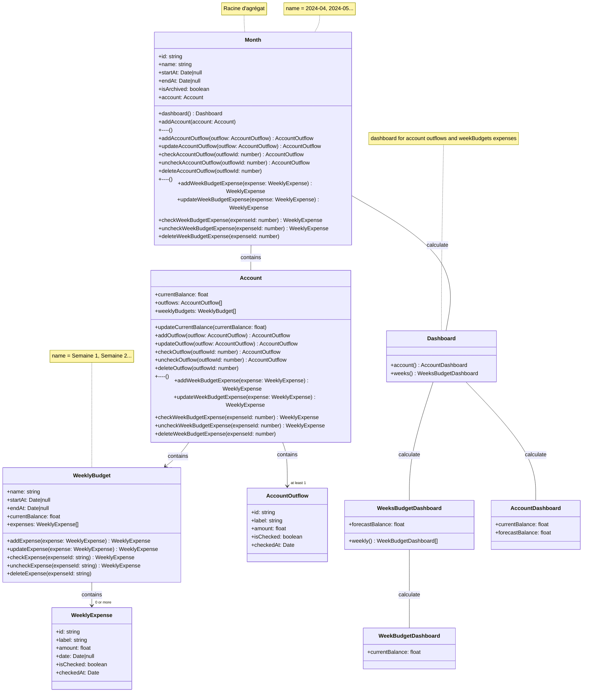

# Créer un mois à partir du template

Au submit du formulaire, récupérer la data et les persister.

## draft de la Command pour la création

```mermaid
classDiagram
    class MonthCreation {
        +date: Date
        +initialBalance: float
        +outflows: OutflowCreation[]
        +weeklyBudgets: WeeklyBudgetCreation[]
    }

    note for WeeklyBudgetCreation "name = Semaine 1, Semaine 2..."
    class WeeklyBudgetCreation {
        +name: string
        +initialBalance: float
    }

    class OutflowCreation {
        +id: string
        +label: string
        +amount: float
    }
    MonthCreation --> "5" WeeklyBudgetCreation: contains
    MonthCreation --> "at least 1" OutflowCreation: contains
```
## draft de classes pour la réponse

```mermaid
classDiagram
    note for WeeklyBudget "name = Semaine 1, Semaine 2..."
    class WeeklyBudget {
        +name: string
        +startAt: Date|null
        +endAt: Date|null
        +currentBalance: float
        +expenses: WeeklyExpense[]
        +addExpense(expense: WeeklyExpense) WeeklyExpense
        +updateExpense(expense: WeeklyExpense) WeeklyExpense
        +checkExpense(expenseId: string) WeeklyExpense
        +uncheckExpense(expenseId: string) WeeklyExpense
        +deleteExpense(expenseId: string)
    }
    class WeeklyExpense {
        +id: string
        +label: string
        +amount: float
        +date: Date|null
        +isChecked: boolean
        +checkedAt: Date
    }
    WeeklyBudget -->"0 or more" WeeklyExpense : contains

    class Account {
        +currentBalance: float
        +outflows: AccountOutflow[]
        +weeklyBudgets: WeeklyBudget[]
        +updateCurrentBalance(currentBalance: float)
        +addOutflow(outflow: AccountOutflow) AccountOutflow
        +updateOutflow(outflow: AccountOutflow) AccountOutflow
        +checkOutflow(outflowId: number) AccountOutflow
        +uncheckOutflow(outflowId: number) AccountOutflow
        +deleteOutflow(outflowId: number)
        +----()
        +addWeekBudgetExpense(expense: WeeklyExpense) WeeklyExpense
        +updateWeekBudgetExpense(expense: WeeklyExpense) WeeklyExpense
        +checkWeekBudgetExpense(expenseId: number) WeeklyExpense
        +uncheckWeekBudgetExpense(expenseId: number) WeeklyExpense
        +deleteWeekBudgetExpense(expenseId: number)
    }
    Account -->"5" WeeklyBudget : contains

    note for Month "Racine d'agrégat"
    note for Month "name = 2024-04, 2024-05..."
    class Month {
        +id: string
        +name: string
        +startAt: Date|null
        +endAt: Date|null
        +isArchived: boolean
        +account: Account
        +dashboard() Dashboard
        +addAccount(account: Account)
        +----()
        +addAccountOutflow(outflow: AccountOutflow) AccountOutflow
        +updateAccountOutflow(outflow: AccountOutflow) AccountOutflow
        +checkAccountOutflow(outflowId: number) AccountOutflow
        +uncheckAccountOutflow(outflowId: number) AccountOutflow
        +deleteAccountOutflow(outflowId: number)
        +----()
        +addWeekBudgetExpense(expense: WeeklyExpense) WeeklyExpense
        +updateWeekBudgetExpense(expense: WeeklyExpense) WeeklyExpense
        +checkWeekBudgetExpense(expenseId: number) WeeklyExpense
        +uncheckWeekBudgetExpense(expenseId: number) WeeklyExpense
        +deleteWeekBudgetExpense(expenseId: number)
    }
    class AccountOutflow {
        +id: string
        +label: string
        +amount: float
        +isChecked: boolean
        +checkedAt: Date
    }
    Month -- Account : contains
    Account -->"at least 1" AccountOutflow : contains

    note for Dashboard "dashboard for account outflows and weekBudgets expenses"
    class Dashboard {
        +account() AccountDashboard
        +weeks() WeeksBudgetDashboard
    }
    class WeekBudgetDashboard {
        +currentBalance: float
    }
    class WeeksBudgetDashboard {
        +forecastBalance: float
        +weekly() WeekBudgetDashboard[]
    }
    class AccountDashboard {
        +currentBalance: float
        +forecastBalance: float
    }
    WeeksBudgetDashboard -- WeekBudgetDashboard : calculate
    Dashboard -- WeeksBudgetDashboard : calculate
    Dashboard -- AccountDashboard : calculate
    Month -- Dashboard : calculate
```
