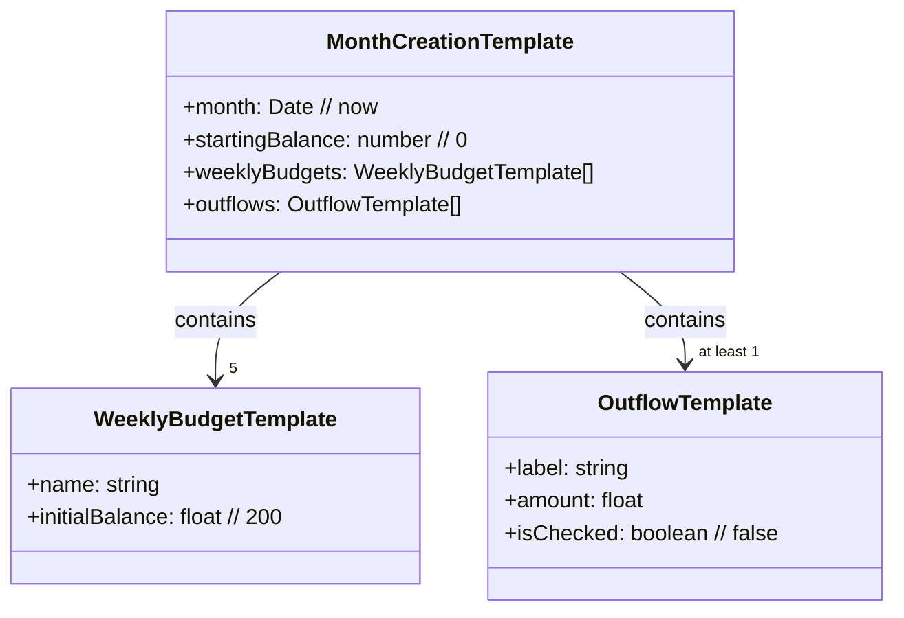

# Afficher le formulaire de création de mois

Le formulaire comprend les champs suivants:

- mois
  - format YYYY-MM 
  - mois courant par défaut
- solde initial
  - 0 par défaut
- budgets par semaine
  - 5 champs 
  - 200 par défaut
- liste des sorties mensuelles

## Sorties mensuelles initiales

| label               | amount |
|---------------------|--------|
| Loyer               | 654.93 |
| Bouygues            | 70.89  |
| EDF                 | 114.62 |
| MACIF               | 92.06  |
| Mutuelle            | 57.67  |
| TAN Liam            | 15.00  |
| TAN Moi             | 30.00  |
| Sandy Liam          | 94.50  |
| Argent de poche     | 20.00  |
| Liam                | 25.00  |
| Spirou              | 11.25  |
| Podcloud            | 6.00   |
| PlanetHoster + BitD | 18.00  |
| Disney+             | 11.99  |
| Suno                | 9.42   |
| Netflix             | 13.49  |
| Prime               | 6.99   |
| Deezer              | 11.99  |
| Croix rouge         | 5.00   |
| Essence             | 80.00  |
| Projet mensuels     | 210.00 |
| Psy 1               | 55.00  |
| Psy 2               | 55.00  |
| Cours maths 1       | 36.00  |
| Cours maths 2       | 36.00  |
| A/R Paris           | 210.00 |

## Draft de classes

## Notes

* Récupérer le template via un _repository_
  * Bien qu'il ne serve à rien actuellement
* Donc juste un `await` et on a le modèle prêt

## Requirements

* MonthCreationTemplate
  * par défaut: month = now
  * par défaut: startingBalance = 0
  * weeklyBudgets doit contenir 5 items
    * numérotées de 1 à 5
  * outflows ne peut pas être vide
* WeeklyBudgetTemplate
  * par défaut: initialBalance = 200
* OutflowTemplate
  * par défaut: isChecked = false

## Historique

...
